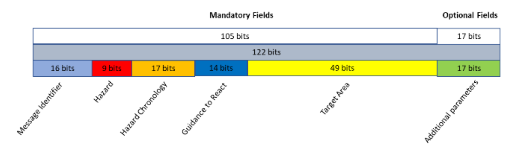

# COMMON ALERT MESSAGE FORMAT

This repository contains [CSV files for tables](data) from the specification v1.0 https://www.gsc-europa.eu/sites/default/files/sites/all/files/EWSS-CAMF_v1.0.pdf

> Note: `data/i18n/fr/*.csv` has been translated from `data/i18n/en/*.csv` using ChatGPT.

## Context: The Common Alert Message Format (CAMF)

The Common Alert Message Format (CAMF) is based on 122 bits, to be encapsulated in the signals of the 🛰️🛰️🛰️🛰️🛰️ satellite navigation systems 🛰️🛰️🛰️🛰️🛰️. This size is driven by design constraints applying to some satellite constellations, where only a limited number of bits is available for messaging. The CAMF has been developed with these constraints. However, if satellite navigation providers have more space in their signals (i.e. spare bits), it is still possible to use these extra bits for extending the information contained in the EWM (e.g. for adding more severity levels, or more instructions).

* Message identifier
  * Message type (A1)
  * Country / Region ID (A2)
  * Provider identifier (A3)
* Hazard
  * Hazard category & type (A4)
  * Severity (A5)
* Hazard chronology
  * Hazard onset: week number (A6)
  * Hazard onset: time of the week (A7)
  * Hazard duration (A8)
* Guidance to react
  * Guidance library selection (A9)
  * Guidance library version (A10)
  * Guidance instructions (A11)
* Target area
  * Ellipse centre latitude (A12)
  * Ellipse centre longitude (A13)
  * Ellipse semi-major axis length (A14)
  * Ellipse semi-minor axis length (A15)
  * Ellipse azimuth angle (A16)
* Additional parameters
  * Main subject (A17)
  * Specific settings (A18)

* https://www.unoosa.org/documents/pdf/icg/2023/ICG-17/icg17_wgb_20.pdf
* https://www.gsc-europa.eu/sites/default/files/sites/all/files/EWSS-CAMF_v1.0.pdf
  * [References into specifications](references.md)

## Languages

### C/C++

* https://github.com/thingsat/riot_modules/tree/main/modules/camf

### Python

TODO

### Javascript/Node

TODO

### Java

TODO

### Rust

TODO

## Media

